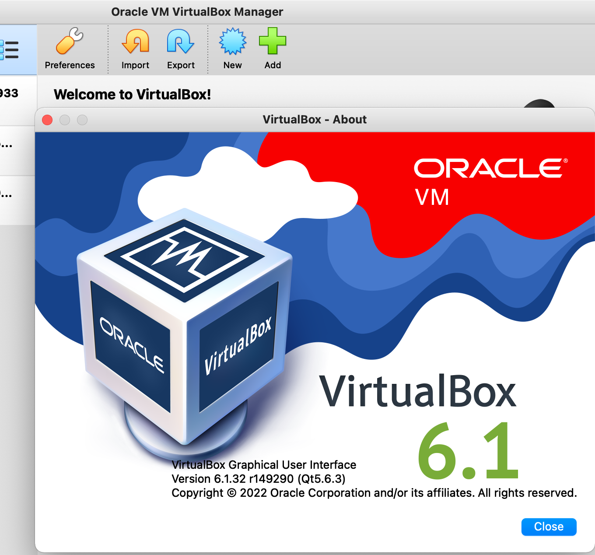
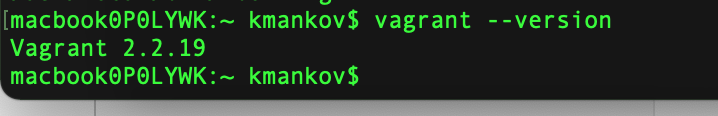
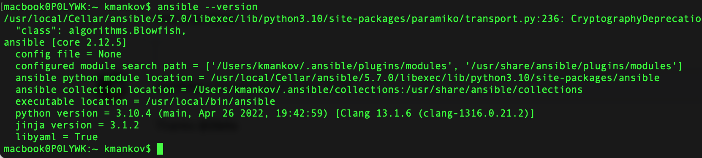

# Домашнее задание к занятию "5.2. Применение принципов IaaC в работе с виртуальными машинами"

## Как сдавать задания

Обязательными к выполнению являются задачи без указания звездочки. Их выполнение необходимо для получения зачета и диплома о профессиональной переподготовке.

Задачи со звездочкой (*) являются дополнительными задачами и/или задачами повышенной сложности. Они не являются обязательными к выполнению, но помогут вам глубже понять тему.

Домашнее задание выполните в файле readme.md в github репозитории. В личном кабинете отправьте на проверку ссылку на .md-файл в вашем репозитории.

Любые вопросы по решению задач задавайте в чате учебной группы.

---

## Задача 1

- Опишите своими словами основные преимущества применения на практике IaaC паттернов.
- Какой из принципов IaaC является основополагающим?

**Ответ:**

- Быстрота разворачивания инфраструктуры для разработки, тестирования
- Стабильность конфигурации, отсутствие накопления случайных различий
- Автоматизация процессов разработки: интеграция изменений, доставки, развертывания приложений

Все это приводит к ускорению разработки и выпуску продукта, уменьшению количества ошибок и ускорению процесса обнаружения и
 устранения ошибок.

Основополагающий принцип IaaC - идемпотентность. При выполнении одних и тех же операций достигается идентичный результат.

## Задача 2

- Чем Ansible выгодно отличается от других систем управление конфигурациями?
- Какой, на ваш взгляд, метод работы систем конфигурации более надёжный push или pull?

**Ответ:**

Ansible имеет более низкий порог вхождения. Для разворачивания не требуется настройки дополнительного окружения, Ansible использует SSH для управления инфраструктурой. Имеет множество подключаемых модулей практических для всех случаев жизни, при желании можно создать свой модуль. Ansible может использоваться на всех стадиях жизненного цикла CI/CD/CD.

Метод pull мне представляется более надежным, так как при возрастании количества управляемых единиц инфраструктуры нагрузка на управляющий узел сильно возрастает, и при методе push управляющий узел может не справляться с нагрузкой. При методе pull управляемые узлы сами скачивают необходимые данные конфигурации. 

## Задача 3

Установить на личный компьютер:

- VirtualBox
- Vagrant
- Ansible

*Приложить вывод команд установленных версий каждой из программ, оформленный в markdown.*






## Задача 4 (*)

Воспроизвести практическую часть лекции самостоятельно.

- Создать виртуальную машину.
- Зайти внутрь ВМ, убедиться, что Docker установлен с помощью команды
```
docker ps
```
