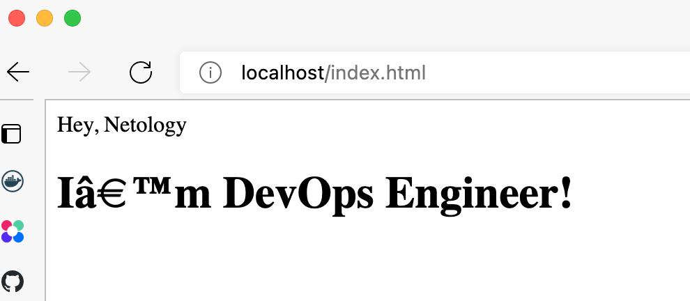

# Домашнее задание к занятию "5.3. Введение. Экосистема. Архитектура. Жизненный цикл Docker контейнера"

## Как сдавать задания

Обязательными к выполнению являются задачи без указания звездочки. Их выполнение необходимо для получения зачета и диплома о профессиональной переподготовке.

Задачи со звездочкой (*) являются дополнительными задачами и/или задачами повышенной сложности. Они не являются обязательными к выполнению, но помогут вам глубже понять тему.

Домашнее задание выполните в файле readme.md в github репозитории. В личном кабинете отправьте на проверку ссылку на .md-файл в вашем репозитории.

Любые вопросы по решению задач задавайте в чате Slack.

---

## Задача 1

Сценарий выполнения задачи:

- создайте свой репозиторий на https://hub.docker.com;
- выберете любой образ, который содержит веб-сервер Nginx;
- создайте свой fork образа;
- реализуйте функциональность:
запуск веб-сервера в фоне с индекс-страницей, содержащей HTML-код ниже:
```
<html>
<head>
Hey, Netology
</head>
<body>
<h1>I’m DevOps Engineer!</h1>
</body>
</html>
```
Опубликуйте созданный форк в своем репозитории и предоставьте ответ в виде ссылки на https://hub.docker.com/username_repo.

Ответ:

```shell
kmankov$ docker login
Login with your Docker ID to push and pull images from Docker Hub. If you don't have a Docker ID, head over to https://hub.docker.com to create one.
Username: kmankov
Password: 
Login Succeeded
```
```shell
kmankov$ docker pull nginx
Using default tag: latest
latest: Pulling from library/nginx
214ca5fb9032: Pull complete 
66eec13bb714: Pull complete 
17cb812420e3: Pull complete 
56fbf79cae7a: Pull complete 
c4547ad15a20: Pull complete 
d31373136b98: Pull complete 
Digest: sha256:2d17cc4981bf1e22a87ef3b3dd20fbb72c3868738e3f307662eb40e2630d4320
Status: Downloaded newer image for nginx:latest
docker.io/library/nginx:latest

kmankov$ docker image ls
REPOSITORY               TAG       IMAGE ID       CREATED        SIZE
nginx                    latest    de2543b9436b   17 hours ago   142MB
docker/getting-started   latest    cb90f98fd791   5 weeks ago    28.8MB
```

```shell
kmankov$ docker tag nginx kmankov/myrepo:mynginx

kmankov$ docker image ls
REPOSITORY               TAG       IMAGE ID       CREATED        SIZE
kmankov/myrepo           mynginx   de2543b9436b   17 hours ago   142MB
nginx                    latest    de2543b9436b   17 hours ago   142MB
docker/getting-started   latest    cb90f98fd791   5 weeks ago    28.8MB

kmankov$ docker push kmankov/myrepo:mynginx
The push refers to repository [docker.io/kmankov/myrepo]
a059c9abe376: Mounted from library/nginx 
09be960dcde4: Mounted from library/nginx 
18be1897f940: Mounted from library/nginx 
dfe7577521f0: Mounted from library/nginx 
d253f69cb991: Mounted from library/nginx 
fd95118eade9: Mounted from library/nginx 
mynginx: digest: sha256:b495f952df67472c3598b260f4b2e2ba9b5a8b0af837575cf4369c95c8d8a215 size: 1570
```

Dockerfile
```
FROM kmankov/myrepo:mynginx
COPY /Users/kmankov/PycharmProjects/virt-homeworks-virt-11/05-virt-03-docker/html /usr/share/nginx/html
```

```shell
kmankov$ docker run -d -p 80:80 kmankov/myrepo:mynginx
b6c187c7090839f8064064f5f4ac004ad92332e631c44b45f85406085afbfa4f

kmankov$ docker ps -a
CONTAINER ID   IMAGE                    COMMAND                  CREATED          STATUS                      PORTS                NAMES
b6c187c70908   kmankov/myrepo:mynginx   "/docker-entrypoint.…"   6 seconds ago    Up 5 seconds                0.0.0.0:80->80/tcp   affectionate_franklin
d7c3bd56fce7   docker/getting-started   "/docker-entrypoint.…"   40 minutes ago   Exited (0) 38 minutes ago                        gifted_bouman
```



https://hub.docker.com/r/kmankov/myrepo


## Задача 2

Посмотрите на сценарий ниже и ответьте на вопрос:
"Подходит ли в этом сценарии использование Docker контейнеров или лучше подойдет виртуальная машина, физическая машина? Может быть возможны разные варианты?"

Детально опишите и обоснуйте свой выбор.

--

Сценарий:

- Высоконагруженное монолитное java веб-приложение - выделенный физический сервер, поскольку требуются все ресурсы сервера, и не желательно иметь "шумных соседей";
- Nodejs веб-приложение - контейнеризация, поскольку это стейтлесс приложение, требует быстрого поднятия в случае падения, быстрого развертывания, предоставляет возможность использования практик CI/CD;
- Мобильное приложение c версиями для Android и iOS - виртуализация, поскольку требуются различные ОС для работы приложений. Хотя неважно на чем работает мобильное приложение, бэкенд может работать на другой ОС, поэтому бэкенд для приложений может работать в контейнерах. Зависит от инфраструктуры приложения;
- Шина данных на базе Apache Kafka - контейниризация, поскольку это стейтлесс приложение, требует быстрого поднятия в случае падения, быстрого развертывания, предоставляет возможность использования практик CI/CD;
- Elasticsearch кластер для реализации логирования продуктивного веб-приложения - три ноды elasticsearch, два logstash и две ноды kibana;
- Мониторинг-стек на базе Prometheus и Grafana - группа контейнеров в виртуальной инфраструктуре, это стейтлес приложения с относительно низкой нагрузкой. Важна воможность быстрого развертывания комплекса мониторинга;
- MongoDB, как основное хранилище данных для java-приложения - выделенный физический сервер, поскольку требуются гарантированное выделение ресурсов сервера, и не желательно иметь "шумных соседей". Либо полная виртуализация с гарантированным выделением ресурсов;
- Gitlab сервер для реализации CI/CD процессов и приватный (закрытый) Docker Registry - контейниризация на физическом или виртуальном сервере. Важна воможность быстрого развертывания инфраструктуры CI/CD, обновление компонентов.

## Задача 3

- Запустите первый контейнер из образа ***centos*** c любым тэгом в фоновом режиме, подключив папку ```/data``` из 
текущей рабочей директории на хостовой машине в ```/data``` контейнера;
- Запустите второй контейнер из образа ***debian*** в фоновом режиме, подключив папку ```/data``` из текущей рабочей 
директории на хостовой машине в ```/data``` контейнера;
- Подключитесь к первому контейнеру с помощью ```docker exec``` и создайте текстовый файл любого содержания в ```/data```;
- Добавьте еще один файл в папку ```/data``` на хостовой машине;
- Подключитесь во второй контейнер и отобразите листинг и содержание файлов в ```/data``` контейнера.

Ответ:

```shell
kmankov$ docker pull centos
Using default tag: latest
latest: Pulling from library/centos
a1d0c7532777: Pull complete 
Digest: sha256:a27fd8080b517143cbbbab9dfb7c8571c40d67d534bbdee55bd6c473f432b177
Status: Downloaded newer image for centos:latest
docker.io/library/centos:latest

kmankov$ docker pull debian
Using default tag: latest
latest: Pulling from library/debian
67e8aa6c8bbc: Pull complete 
Digest: sha256:6137c67e2009e881526386c42ba99b3657e4f92f546814a33d35b14e60579777
Status: Downloaded newer image for debian:latest
docker.io/library/debian:latest

kmankov$ docker image ls
REPOSITORY               TAG       IMAGE ID       CREATED        SIZE
debian                   latest    c4905f2a4f97   7 days ago     124MB
centos                   latest    5d0da3dc9764   8 months ago   231MB
```

```
[root@fedora mankov]# mkdir /data
[root@fedora mankov]# docker run -it -v /data:/data --name centos centos bash

[root@fb0da1312109 /]# touch /data/test_centos.txt
[root@fb0da1312109 /]# cat <<EOF>/data/test_centos.txt
> test write to volume from centos
> EOF                            
[root@fb0da1312109 /]# ls /data/
test_centos.txt
[root@fb0da1312109 /]# exit

[root@fedora mankov]# ls /data
test_centos.txt

[root@fedora mankov]# cat <<EOF>/data/test_host.txt
> test write to volume from host
> EOF

[root@fedora mankov]# ls /data
test_centos.txt  test_host.txt

[root@fedora mankov]# docker run -it -v /data:/data --name debian debian bash
Unable to find image 'debian:latest' locally
latest: Pulling from library/debian
67e8aa6c8bbc: Pull complete 
Digest: sha256:6137c67e2009e881526386c42ba99b3657e4f92f546814a33d35b14e60579777
Status: Downloaded newer image for debian:latest

root@49fd2ca2f44e:/# ls -l /data
total 8
-rw-r--r-- 1 root root 33 May 19 07:16 test_centos.txt
-rw-r--r-- 1 root root 31 May 19 07:17 test_host.txt
root@49fd2ca2f44e:/# 
exit

[root@fedora mankov]# docker ps -a
CONTAINER ID   IMAGE         COMMAND    CREATED          STATUS                          PORTS     NAMES
49fd2ca2f44e   debian        "bash"     27 seconds ago   Exited (0) 5 seconds ago                  debian
fb0da1312109   centos        "bash"     3 minutes ago    Exited (0) About a minute ago             centos
2aedfcc8f99c   hello-world   "/hello"   52 minutes ago   Exited (0) 52 minutes ago                 affectionate_montalcini
```


## Задача 4 (*)

Воспроизвести практическую часть лекции самостоятельно.

Соберите Docker образ с Ansible, загрузите на Docker Hub и пришлите ссылку вместе с остальными ответами к задачам.

https://hub.docker.com/layers/myrepo/kmankov/myrepo/ansible-2.10.0/images/sha256-f0f84b1cf8d38f3d0dec84406eac6c928dfcca37327e3fc85d284e5586d33001?context=repo

---

### Как cдавать задание

Выполненное домашнее задание пришлите ссылкой на .md-файл в вашем репозитории.

---
