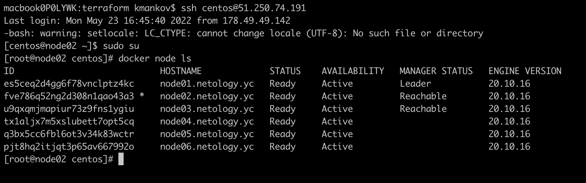
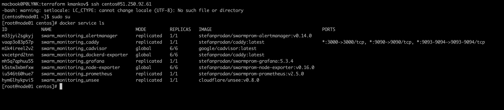
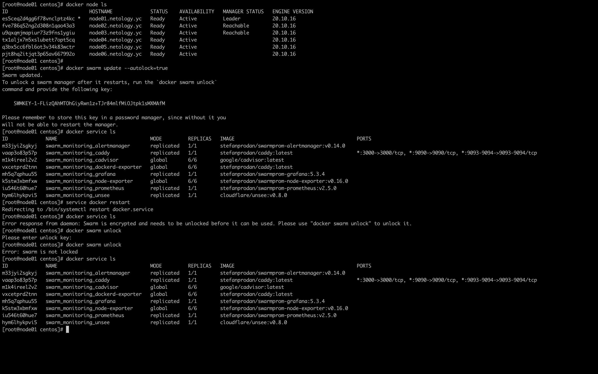

# Домашнее задание к занятию "5.5. Оркестрация кластером Docker контейнеров на примере Docker Swarm"

## Задача 1

Дайте письменные ответы на следующие вопросы:

- В чём отличие режимов работы сервисов в Docker Swarm кластере: replication и global?

В режиме replication docker запускает указанное количество реплик сервиса с указанием максимального количества
реплик на узле, если узел с запущенным экземпляром сервиса становится не доступен, то экземпляр сервиса 
запускается на другом узле.
В режиме global экземпляры сервиса запускается на каждом узле кластера, т.е. работают на всех узлах.

- Какой алгоритм выбора лидера используется в Docker Swarm кластере?

Используется алгоритм RAFT.

- Что такое Overlay Network?

Overlay Network - это виртуальная сеть туннелей, натянутая поверх физической сети. Такая сеть позволяет избежать 
настройки маршрутизации на узлах кластера распределенных по различным виртуальным машинам, позволяя узлам 
кластера работать в одной виртуальной сети.

## Задача 2

Создать ваш первый Docker Swarm кластер в Яндекс.Облаке

Для получения зачета, вам необходимо предоставить скриншот из терминала (консоли), с выводом команды:
```
docker node ls
```



## Задача 3

Создать ваш первый, готовый к боевой эксплуатации кластер мониторинга, состоящий из стека микросервисов.

Для получения зачета, вам необходимо предоставить скриншот из терминала (консоли), с выводом команды:
```
docker service ls
```



## Задача 4 (*)

Выполнить на лидере Docker Swarm кластера команду (указанную ниже) и дать письменное описание её функционала, 
что она делает и зачем она нужна:
```
# см.документацию: https://docs.docker.com/engine/swarm/swarm_manager_locking/
docker swarm update --autolock=true
```
Docker шифрует журналы Raft для обеспечения безопасности и защиты конфигурации сервисов и данных. Докер предоставляет 
возможность залочить ключи шифрования от несанкционированного доступа. Указанная команда включает режим автоблокировки 
ключей при рестарте кластера. При этом сервисы работать не будут, так как ключи шифрования еще не доступны. 
Чтобы получить доступ к управлению кластером, а также чтобы он заработал, необходимо разблокировать ключи командой 
```docker swarm unlock```, которая потребует ввести парольную фразу. После разблокировки 
ключи шифрования станут доступны менеджеру кластера, и запустятся сервисы.



---

### Как сдавать задание

Выполненное домашнее задание пришлите ссылкой на .md-файл в вашем репозитории.

---
