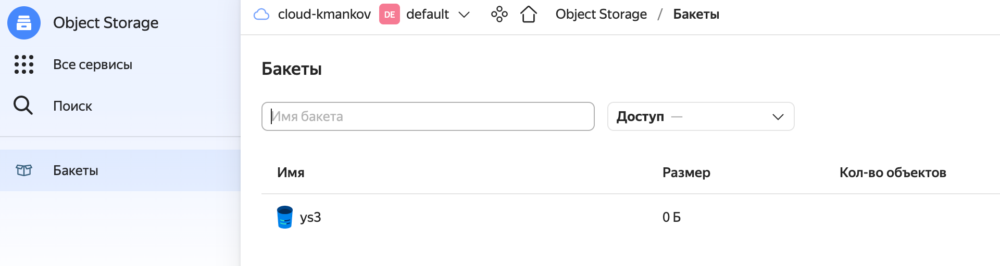
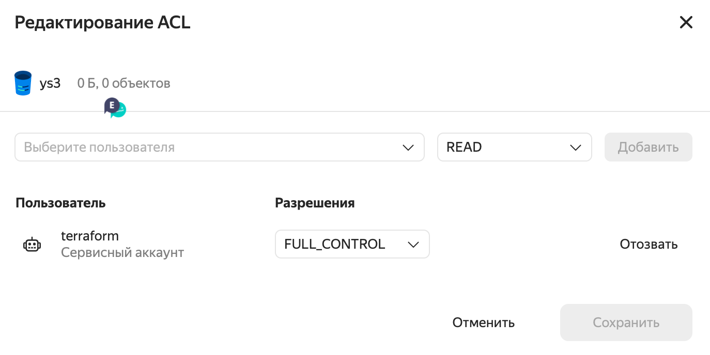

# Домашнее задание к занятию "7.3. Основы и принцип работы Терраформ"

## Задача 1. Создадим бэкэнд в S3 (необязательно, но крайне желательно)

Если в рамках предыдущего задания у вас уже есть аккаунт AWS, то давайте продолжим знакомство со взаимодействием
терраформа и aws.

1. Создайте s3 бакет, iam роль и пользователя от которого будет работать терраформ. Можно создать отдельного пользователя,
а можно использовать созданного в рамках предыдущего задания, просто добавьте ему необходимы права, как описано 
[здесь](https://www.terraform.io/docs/backends/types/s3.html).
1. Зарегистрируйте бэкэнд в терраформ проекте как описано по ссылке выше.

**Ответ**




## Задача 2. Инициализируем проект и создаем воркспейсы

1. Выполните `terraform init`:
    * если был создан бэкэнд в S3, то терраформ создаст файл стейтов в S3 и запись в таблице dynamodb.
    * иначе будет создан локальный файл со стейтами.  
1. Создайте два воркспейса `stage` и `prod`.
1. В уже созданный `aws_instance` добавьте зависимость типа инстанса от воркспейса, что бы в разных воркспейсах 
использовались разные `instance_type`.
1. Добавим `count`. Для `stage` должен создаться один экземпляр `ec2`, а для `prod` два.
1. Создайте рядом еще один `aws_instance`, но теперь определите их количество при помощи `for_each`, а не `count`.
1. Что бы при изменении типа инстанса не возникло ситуации, когда не будет ни одного инстанса добавьте параметр
жизненного цикла `create_before_destroy = true` в один из ресурсов `aws_instance`.
1. При желании поэкспериментируйте с другими параметрами и ресурсами.

В виде результата работы пришлите:

* Вывод команды `terraform workspace list`.
* Вывод команды `terraform plan` для воркспейса `prod`.  

**Ответ**

```text
macbook0P0LYWK:terraform kmankov$ terraform init

Initializing the backend...

Initializing provider plugins...
- Finding latest version of yandex-cloud/yandex...
- Installing yandex-cloud/yandex v0.76.0...
- Installed yandex-cloud/yandex v0.76.0 (self-signed, key ID E40F590B50BB8E40)
```

```text
macbook0P0LYWK:terraform kmankov$ terraform workspace new prod
Created and switched to workspace "prod"!

macbook0P0LYWK:terraform kmankov$ terraform workspace new stage
Created and switched to workspace "stage"!

macbook0P0LYWK:terraform kmankov$ terraform workspace list
  default
  stage
* prod
```

```shell
$ terraform plan -var-file="terraform.tfvars" 
data.terraform_remote_state.vpc: Reading...
data.terraform_remote_state.vpc: Read complete after 0s

Terraform used the selected providers to generate the following execution plan. Resource actions are indicated with the following symbols:
  + create

Terraform will perform the following actions:

  # yandex_compute_instance_group.group01 will be created
  + resource "yandex_compute_instance_group" "group01" {
      + created_at          = (known after apply)
      + deletion_protection = false
      + folder_id           = "b1g0k1eq7s5942g41mdq"
      + id                  = (known after apply)
      + instances           = (known after apply)
      + name                = "prod"
      + service_account_id  = "ajev8pdvndpdi8qbaauo"
      + status              = (known after apply)

      + allocation_policy {
          + zones = [
              + "ru-central1-b",
            ]
        }

      + deploy_policy {
          + max_creating     = 0
          + max_deleting     = 0
          + max_expansion    = 2
          + max_unavailable  = 2
          + startup_duration = 0
          + strategy         = (known after apply)
        }

      + instance_template {
          + labels      = (known after apply)
          + metadata    = {
              + "user-data" = <<-EOT
                    users:
                      - name: jack
                        groups: sudo
                        shell: /bin/bash
                        sudo: ['ALL=(ALL) NOPASSWD:ALL']
                        ssh_authorized_keys:
                          - ssh-rsa AAAAB3Nza......OjbSMRX jack@hi.com
                EOT
            }
          + platform_id = "standard-v2"

          + boot_disk {
              + device_name = (known after apply)
              + mode        = "READ_WRITE"

              + initialize_params {
                  + image_id    = "fd88d14a6790do254kj7"
                  + size        = 50
                  + snapshot_id = (known after apply)
                  + type        = "network-nvme"
                }
            }

          + network_interface {
              + ip_address   = (known after apply)
              + ipv4         = true
              + ipv6         = (known after apply)
              + ipv6_address = (known after apply)
              + nat          = true
              + subnet_ids   = (known after apply)
            }

          + resources {
              + core_fraction = 100
              + cores         = 2
              + memory        = 2
            }

          + scheduling_policy {
              + preemptible = (known after apply)
            }
        }

      + scale_policy {

          + fixed_scale {
              + size = 2
            }
        }
    }

  # yandex_vpc_network.net-1 will be created
  + resource "yandex_vpc_network" "net-1" {
      + created_at                = (known after apply)
      + default_security_group_id = (known after apply)
      + folder_id                 = (known after apply)
      + id                        = (known after apply)
      + labels                    = (known after apply)
      + name                      = "net-prod"
      + subnet_ids                = (known after apply)
    }

  # yandex_vpc_subnet.subnet-1 will be created
  + resource "yandex_vpc_subnet" "subnet-1" {
      + created_at     = (known after apply)
      + folder_id      = (known after apply)
      + id             = (known after apply)
      + labels         = (known after apply)
      + name           = "subnet-prod"
      + network_id     = (known after apply)
      + v4_cidr_blocks = [
          + "192.168.90.0/24",
        ]
      + v6_cidr_blocks = (known after apply)
      + zone           = "ru-central1-b"
    }

Plan: 3 to add, 0 to change, 0 to destroy.

```
---

### Как сдавать задание

Выполненное домашнее задание пришлите ссылкой на .md-файл в вашем репозитории.

---
